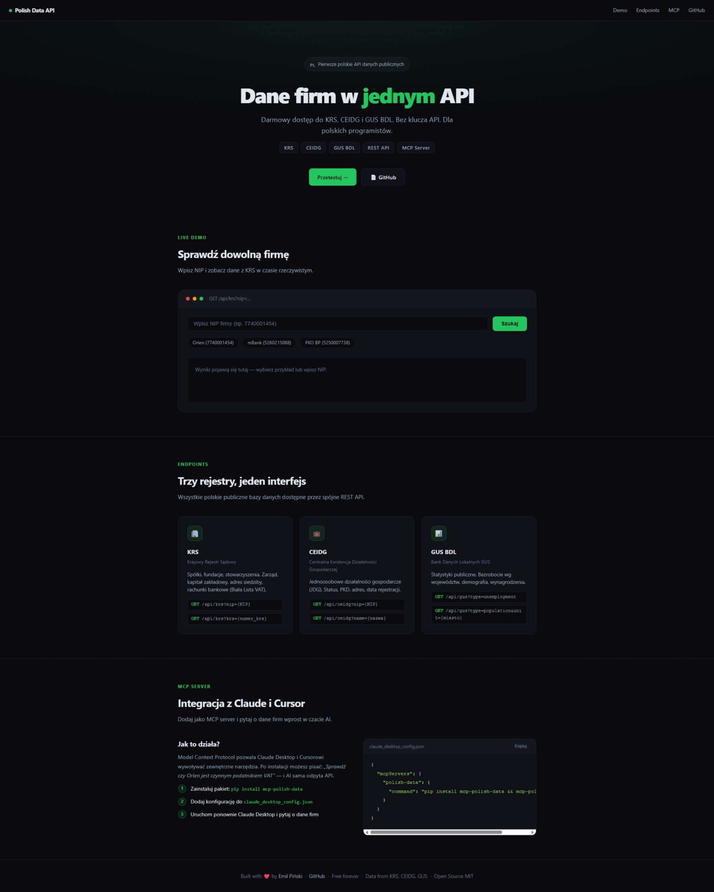
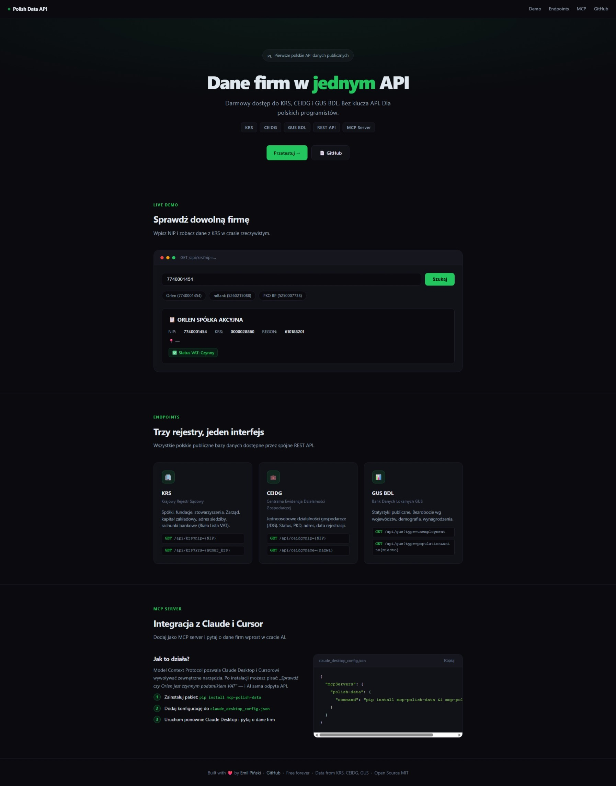

# mcp-polish-data

[](https://github.com/emilpinski/mcp-polish-data/actions/workflows/ci.yml)


> MCP Server with Polish public data — KRS, CEIDG, GUS BDL for Claude, Cursor, and Windsurf.


## What is it

A Model Context Protocol (MCP) server that gives AI assistants direct access to Polish government registries and GUS statistics without leaving the chat. Install once, and Claude or Cursor automatically knows how to look up companies in KRS, verify sole traders in CEIDG, and retrieve regional statistics from GUS BDL.

MIT licensed, no API key required.

## Features

- **KRS** — look up a company by NIP (via VAT Whitelist — KRS API doesn't support name search), retrieve full extract by 9 or 10-digit KRS number
- **CEIDG** — search sole trader businesses by name, NIP, REGON, or owner surname
- **GUS BDL** — population by voivodeship, unemployment rate, average gross salary, statistical variable discovery
- **Graceful degradation** — when CEIDG requires a JWT token, the server provides a helpful message instead of crashing
- **Zero configuration** — single pip install, no API keys required for basic functions
- **Python 3.11+** — async/await, httpx, FastMCP 2.0

## Stack

| Layer | Technology |
|-------|-----------|
| Protocol | Model Context Protocol (MCP) |
| Framework | FastMCP 2.0 |
| HTTP | httpx (async) |
| Python | 3.11+ |
| Build | Hatchling |
| Tests | pytest, pytest-asyncio |
| License | MIT |

## Getting Started

```bash
pip install mcp-polish-data
```

### Claude Desktop

Edit `~/Library/Application Support/Claude/claude_desktop_config.json` (macOS) or `%APPDATA%\Claude\claude_desktop_config.json` (Windows):

```json
{
  "mcpServers": {
    "polish-data": {
      "command": "mcp-polish-data"
    }
  }
}
```

Restart Claude Desktop — tools will appear automatically.

### Cursor / Windsurf

```bash
git clone https://github.com/emilpinski/mcp-polish-data
cd mcp-polish-data
pip install -e ".[dev]"
pytest tests/ -v -m "not integration"
```

## Available Tools

| Tool | Description |
|------|-------------|
| `krs_search_company(nip)` | Search company by NIP (via VAT Whitelist — KRS API doesn't support name search) |
| `krs_get_company_details(krs_number)` | Full extract for a 9 or 10-digit KRS number |
| `ceidg_search_business(name, nip, regon, surname)` | Search sole traders in CEIDG |
| `gus_get_population(unit_name, year)` | Population by voivodeship |
| `gus_get_unemployment_rate(year)` | Unemployment rate by voivodeship |
| `gus_get_average_salary(year)` | Average gross salary by voivodeship |
| `gus_search_variable(query)` | Discover statistical variables in GUS BDL |

## Environment Variables

| Variable | Description | Required |
|----------|-------------|----------|
| `CEIDG_TOKEN` | JWT token for advanced CEIDG endpoints | optional |

## Example Prompts

- *"Look up NIP 5270103391 and tell me the company name and address"*
- *"Compare the unemployment rate in 2023 across all voivodeships"*
- *"What is the average salary in Pomerania vs Masovia?"*
- *"Find all CEIDG sole traders with surname Kowalski in Kraków"*

## Status

Live — [mcp-polish-data.vercel.app](https://mcp-polish-data.vercel.app) | [PyPI: mcp-polish-data](https://pypi.org/project/mcp-polish-data/)

---
Built by [Emil Piński](https://emilpinski.pl)

## Screenshots



